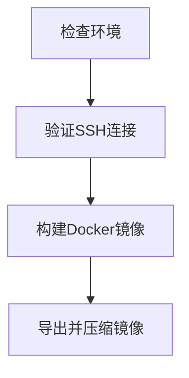
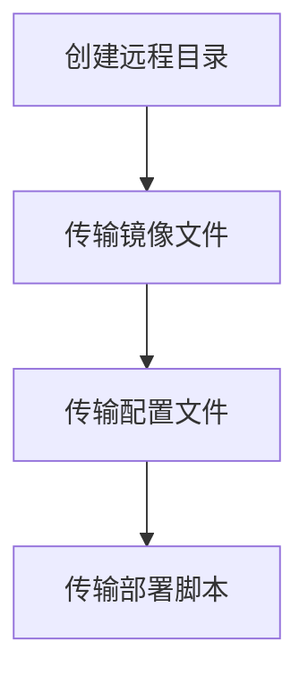
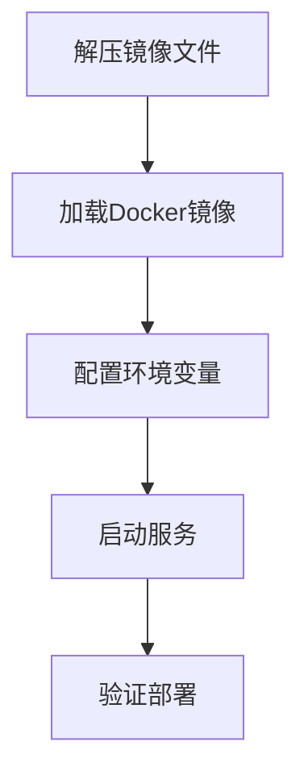

# 本地构建远程部署指南

本文档介绍如何在本地构建 Docker 镜像，然后通过 SSH 直接传输到远程服务器部署，无需 Docker Registry。

## 🎯 适用场景

- 远程服务器资源有限，无法进行 Docker 构建
- 网络环境限制，无法访问 Docker Hub 等公共镜像仓库
- 企业内网环境，需要离线部署
- 希望在本地验证构建后再部署到生产环境

## 📋 前提条件

### 本地环境

- Docker 已安装并正常运行
- SSH 客户端 (ssh、scp 命令可用)
- 项目源代码和配置文件

### 远程服务器

- Docker 和 Docker Compose 已安装
- SSH 服务运行正常
- 足够的磁盘空间存储镜像和数据
- 网络端口 80、443、8080 可访问

### SSH 配置

- 已配置 SSH 密钥认证（推荐）或密码认证
- 当前用户在远程服务器有 Docker 操作权限

## 🚀 部署步骤

### 0. 配置 SSH（可选，推荐）

为了简化部署操作，建议配置 SSH config 文件：

```bash
# 编辑 SSH 配置
nano ~/.ssh/config
```

添加服务器配置：

```
Host myserver
    HostName your-server.com
    User root
    Port 22
    IdentityFile ~/.ssh/id_rsa
    StrictHostKeyChecking no
    UserKnownHostsFile /dev/null

Host production
    HostName 192.168.1.100
    User deploy
    Port 2222
    IdentityFile ~/.ssh/production_key
```

配置后可以直接使用：

```bash
# 测试连接
ssh myserver

# 使用脚本部署
./scripts/deploy-direct.sh --ssh-target myserver
```

### 1. 准备环境配置

```bash
# 复制环境配置模板
cp .env.production.image.example .env.production

# 编辑配置文件
nano .env.production
```

**必须配置的关键参数：**

```bash
# 域名配置
DOMAIN=your-domain.com

# 数据库密码
POSTGRES_PASSWORD=your-strong-password

# 认证密钥（使用 openssl rand -hex 32 生成）
BETTER_AUTH_SECRET=your-32-char-secret-key

# 应用访问地址
BETTER_AUTH_URL=https://your-domain.com
NEXT_PUBLIC_APP_URL=https://your-domain.com
```

### 2. 执行直接传输部署

```bash
# 确保脚本有执行权限
chmod +x scripts/deploy-direct.sh

# 方式1: 使用传统参数
./scripts/deploy-direct.sh \
  --host your-server.com \
  --user root \
  --port 22

# 方式2: 使用 SSH config（推荐）
./scripts/deploy-direct.sh --ssh-target myserver

# 方式3: 使用 user@host 格式
./scripts/deploy-direct.sh --ssh-target root@192.168.1.100
```

### 3. 配置远程环境

SSH 登录到远程服务器：

```bash
ssh -p 22 root@your-server.com
cd /opt/class-tool

# 编辑环境配置
nano .env.production

# 重启服务以应用新配置
docker compose -f docker-compose.prod.yml restart
```

### 4. 验证部署

```bash
# 检查服务状态
docker compose -f docker-compose.prod.yml ps

# 查看服务日志
docker compose -f docker-compose.prod.yml logs -f

# 测试 HTTPS 访问
curl -f https://your-domain.com/api/health
```

## 🔧 脚本参数说明

`deploy-direct.sh` 脚本支持以下参数：

```bash
--host <hostname>        远程服务器地址
--user <username>        远程服务器用户名
--port <port>           SSH 端口 (默认: 22)
--project-dir <path>    远程项目目录 (默认: /opt/class-tool)
--image-name <name>     镜像名称 (默认: class-tool)
--image-tag <tag>       镜像标签 (默认: latest)
```

**使用示例：**

```bash
# 基本使用
./scripts/deploy-direct.sh --host 192.168.1.100 --user ubuntu

# 自定义端口和目录
./scripts/deploy-direct.sh \
  --host myserver.com \
  --port 2222 \
  --user deploy \
  --project-dir /home/deploy/class-tool

# 自定义镜像信息
./scripts/deploy-direct.sh \
  --host server.com \
  --user root \
  --image-name my-class-tool \
  --image-tag v1.0.0
```

## 📊 部署流程详解

### 1. 本地构建阶段



### 2. 传输阶段



### 3. 远程部署阶段



## 🛠️ 故障排除

### SSH 连接问题

```bash
# 测试 SSH 连接
ssh -o ConnectTimeout=10 -p 22 root@your-server.com "echo 'SSH OK'"

# 检查 SSH 配置
cat ~/.ssh/config
cat ~/.ssh/known_hosts
```

### Docker 权限问题

```bash
# 在远程服务器添加用户到 docker 组
sudo usermod -aG docker $USER
newgrp docker

# 或使用 sudo 运行 docker 命令
```

### 镜像加载失败

```bash
# 检查镜像文件完整性
ls -la class-tool_latest.tar.gz
gunzip -t class-tool_latest.tar.gz

# 手动加载镜像
gunzip class-tool_latest.tar.gz
docker load -i class-tool_latest.tar
```

### 服务启动问题

```bash
# 检查环境配置
cat .env.production

# 检查端口占用
netstat -tlnp | grep -E ':80|:443|:8080'

# 查看详细错误日志
docker compose -f docker-compose.prod.yml logs --tail 100
```

## 🔄 更新部署

当需要更新应用时，重新执行部署脚本即可：

```bash
# 拉取最新代码
git pull origin main

# 更新环境配置（如果有变化）
nano .env.production

# 重新部署
./scripts/deploy-direct.sh --host your-server.com --user root
```

## 📈 性能优化建议

### 1. 镜像优化

- 使用 .dockerignore 排除不必要文件
- 多阶段构建减少镜像体积
- 利用 Docker 层缓存

### 2. 网络优化

- 使用压缩传输减少带宽占用
- 断点续传支持（rsync）
- 并行传输多个文件

### 3. 安全加固

- 使用 SSH 密钥认证
- 配置防火墙规则
- 定期更新系统和 Docker

## 📞 技术支持

如遇到问题，请检查：

1. **网络连接**：SSH 是否可正常连接
2. **权限配置**：Docker 权限是否正确
3. **资源状况**：磁盘空间和内存是否充足
4. **配置文件**：环境变量是否正确设置
5. **日志信息**：查看详细的错误日志

**常用调试命令：**

```bash
# 查看系统资源
df -h
free -h
docker system df

# 检查服务状态
systemctl status docker
docker compose -f docker-compose.prod.yml ps

# 查看网络连接
ss -tlnp | grep -E ':80|:443|:3000|:5432'
```
